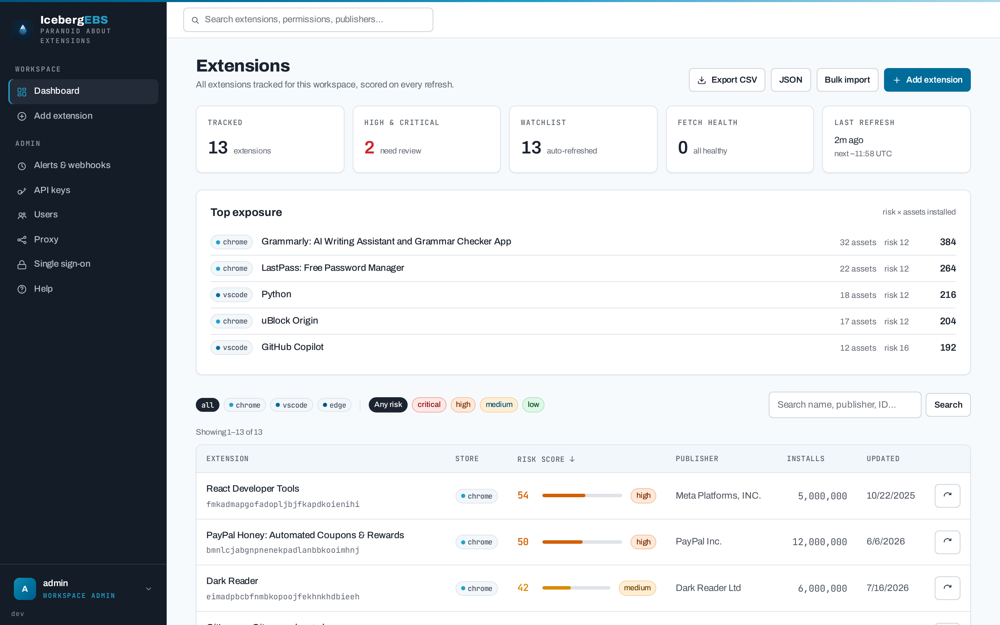
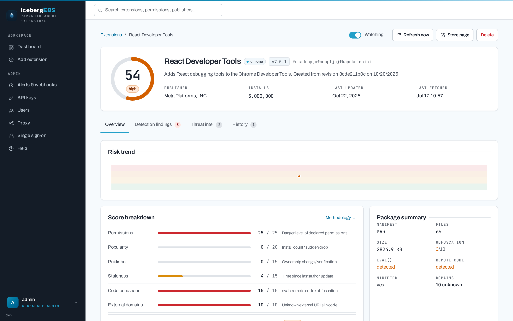
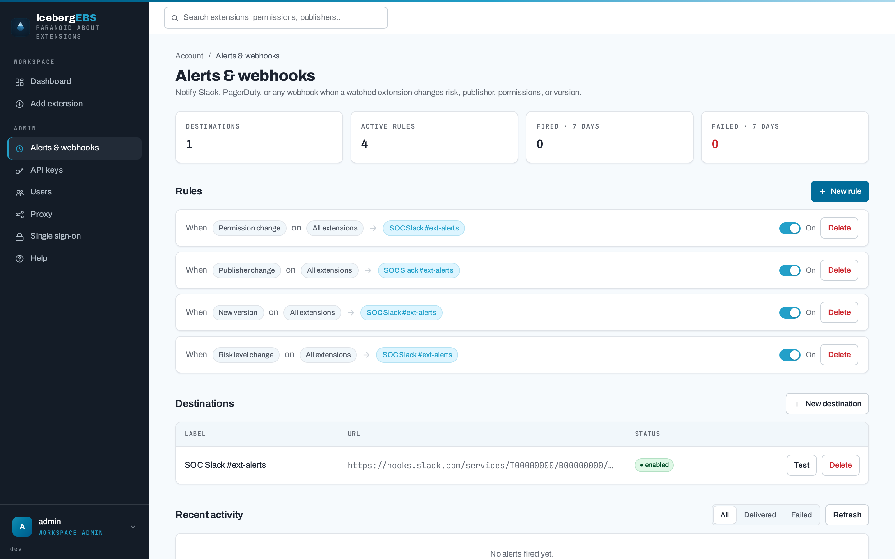
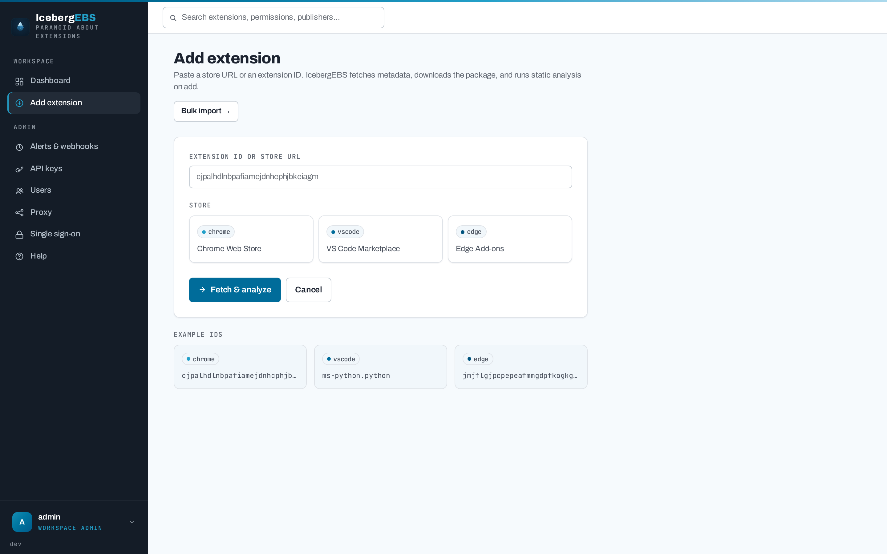
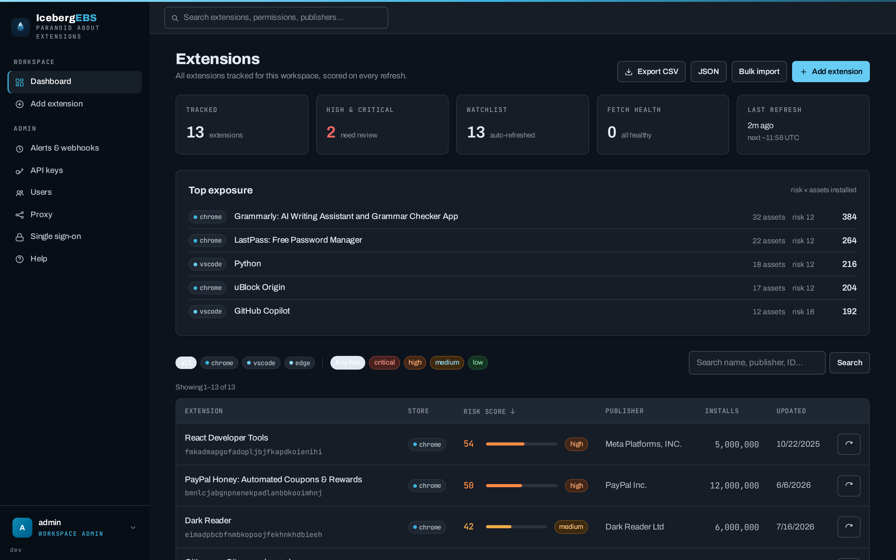

Extension risk monitoring

Paranoid about browser extensions.

IcebergEBS watches the Chrome, Edge, and VS Code extensions your organisation runs —
downloading the actual packages, inspecting the code inside them, scoring the risk
across six signals, and alerting you when something changes.

[How scoring works](scoring.md){ .md-button .md-button--primary }
[Deploy it](deployment.md){ .md-button }
[View on GitHub](https://github.com/IcebergAI/IcebergEBS){ .md-button }

## Why IcebergEBS

An extension is third-party code with access to every page your staff visit, updated
silently, by a publisher who can change at any time. Store listings tell you almost
nothing about that.

IcebergEBS tracks the extensions you care about, **downloads and inspects each
package**, and produces a **0–100 risk score** from permissions, install base,
publisher identity, staleness, code behaviour, and the external domains the code
reaches. A background scheduler re-checks watchlisted extensions and fires a webhook
when the risk band, publisher, permissions, or version changes. It is multi-user —
each user keeps an independent watchlist — and API-first, so it drops into a SOAR
pipeline as easily as a browser tab.

-   :material-magnify-scan: __Real package inspection__

    ---

    Downloads the CRX or VSIX and reads the code — `eval`, remote script loading,
    obfuscation, minification, and every external domain. No code is ever executed.

    [:octicons-arrow-right-24: What inspection does](scoring.md#package-inspection)

-   :material-gauge: __Six-signal risk score__

    ---

    Permissions, popularity, publisher, staleness, code behaviour, and external
    domains — each capped, summed to 0–100, with a full per-signal breakdown.

    [:octicons-arrow-right-24: The scoring model](scoring.md)

-   :material-store-search: __Three stores__

    ---

    Chrome Web Store, Edge Add-ons, and the VS Code Marketplace, each with its own
    fetcher and its own honest account of which signals it can supply.

-   :material-bell-ring: __Change alerting__

    ---

    Webhooks on risk-band changes, publisher changes, permission changes, and new
    versions — persisted before delivery, so a crash re-fires rather than loses them.

    [:octicons-arrow-right-24: Alerts &amp; API](alerts.md)

-   :material-api: __API-first__

    ---

    Every screen is built on the same REST API. Bulk import an inventory, export to
    CSV or JSON, and drive it with scoped, revocable API keys.

-   :material-shield-lock: __Hardened by default__

    ---

    Strict `script-src 'self'` CSP with no inline scripts, SSRF-guarded webhooks
    with IP pinning, bcrypt with constant-time login, OIDC SSO, and signed release
    images.

    [:octicons-arrow-right-24: Security posture](security.md)

## See it

The **dashboard** — everything you track, ranked by risk, with org-wide exposure at a
glance.

{ .shot }

{ .shot }

{ .shot }

{ .shot }

{ .shot }

## How a check runs

| | Step | What happens |
|---:|---|---|
| **1** | **Fetch** | Store metadata — name, publisher, version, install count, last-updated |
| **2** | **Download** | The actual package: a CRX (Chrome, Edge) or VSIX (VS Code) |
| **3** | **Inspect** | A passive read of the archive — manifest, permissions, code patterns, external domains |
| **4** | **Score** | Six signals summed to 0–100, stored with a full per-signal breakdown |
| **5** | **Compare** | Against the previous fetch: risk band, publisher, permissions, version |
| **6** | **Alert** | A webhook per matching rule — persisted before delivery, so a crash re-fires |

Every fetch — scheduled or manual — writes a history record carrying the score
before and after, so the trend charts and the change alerts are built from the same
data. Nothing is executed, and nothing is sent to a third party.

## Next steps

-   :material-gauge: __[Risk scoring](scoring.md)__ — the six signals, the bands, and what inspection can and cannot see.

-   :material-rocket-launch: __[Deployment](deployment.md)__ — Docker Compose or Helm, behind Caddy, on PostgreSQL.

-   :material-webhook: __[Alerts &amp; API](alerts.md)__ — webhook payloads, delivery guarantees, and the REST surface.

-   :material-shield-check: __[Security](security.md)__ — the hardening posture, the known limits, and how to report a vulnerability.

